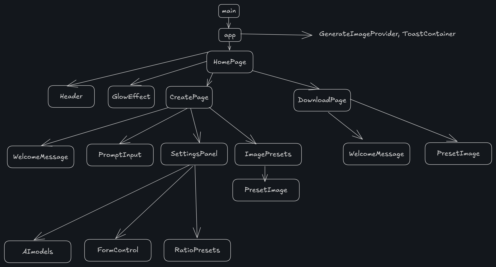
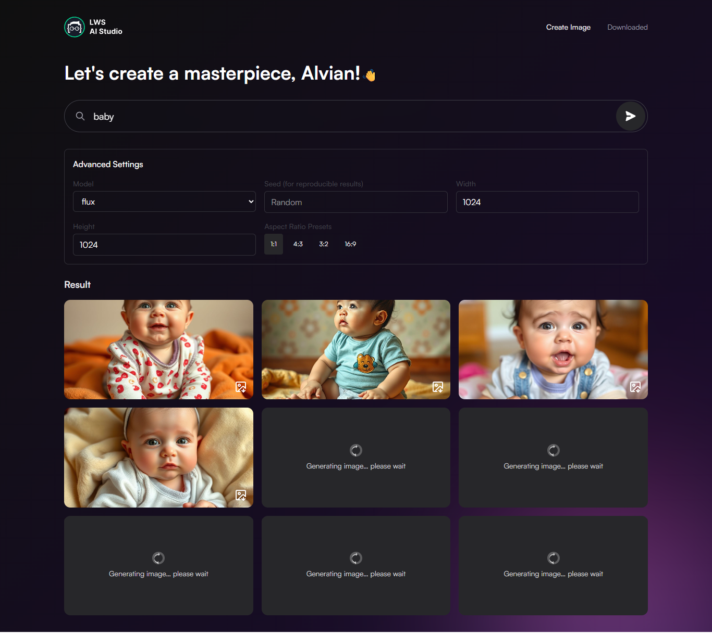
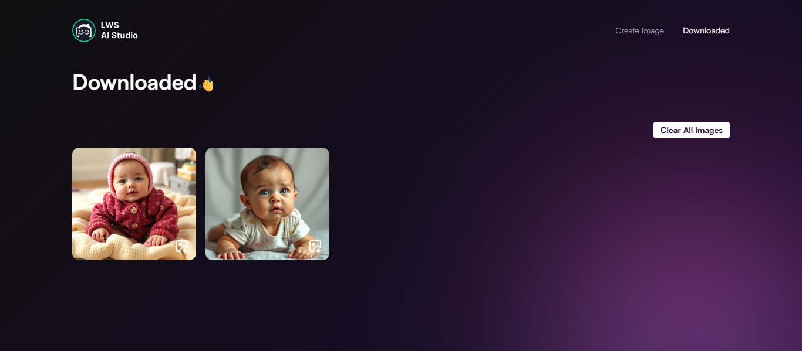

# AI Studio — Prompt-Based Image Generator

## Description

AI Studio is a prompt-based image generator web app built with React. It leverages the [Pollinations AI API](https://github.com/pollinations/pollinations/blob/master/APIDOCS.md#generate-image-api-%EF%B8%8F) to generate images from text prompts using different AI models. The app allows users to adjust advanced settings like aspect ratios and resolutions, view generated images progressively, and download selected ones — all with a smooth, intuitive interface.

---

## Technologies Used

- React
- Tailwind CSS
- Context API
- useReducer hook
- LocalStorage - to persist downloaded images
- react-toastify (for toast notifications)

---

## Component Tree

---

## Features

🔍 **Prompt-based generation** — Generate AI images from any text prompt.
🧠 **Model selection** — Choose from different AI models for creative variety.
⚙️ **Advanced settings** — Adjust image width, height, and use preset aspect ratios (1:1, 4:3, 16:9, etc).
💾 **Download manager** — Download generated images and save them to a "Downloaded" page with persistence.
⚠️ **Error handling** — Handles timeouts or load failures with clear visual indicators.
📦 **Local caching** — Caches downloaded images using localStorage.
🔔 **Toast notifications** — Provides user feedback via toasts for prompt errors or settings issues.

---

## Project Breakdown

- **Image Generation Logic:** Uses a `Context` provider to manage global state like the prompt, model, dimensions, and image list. Each image is generated sequentially with a 5-second delay to respect API limits and generate different images with same prompt.

- **State Management:** Context API manages the image state, model selection, input prompt across the app.

- **LocalStorage Integration:** Images downloaded by the user are stored in localStorage and loaded automatically on the `Download` page and also user can clear all images from download page.

- **Aspect Ratio Presets:** Includes a utility functions that maps aspect ratios like 16:9, 4:3, etc., to sync with width/height fields.

- **Progressive Rendering:** As each image finishes generating, it is shown immediately on the page, with visual loading/error states for feedback.

- **Rate Limiting:** The app uses a delayed queue to prevent multiple image requests from hitting the API simultaneously, complying with `Pollinations API’s` 1-request-per-5-seconds rule.

- **Component Reusability:** Logic is broken into small, testable components like FormControl, RatioButton, and PresetImage.

---

## What I Learned

- How to structure global state using `Context API` and manage interdependent values like aspect ratio.
- How to use `useEffect` and fetch data from outside api call.
- How to handle API rate limits gracefully using sequential logic with delay and per-image loading indicators.
- How to build a download system using localStorage with uniqueness checks to avoid duplicates.
- How to structure clean UI logic with Tailwind CSS and modular, reusable components.

---

## Demo

---

## How to Run

1. Clone the repo
2. Run `npm install` to install dependencies
3. Run `npm run dev` to start the development server
4. Open [http://localhost:5173](http://localhost:5173) to view it in the browser

---

## 🙋‍♂️ About Me

I'm `Hazzaz Abdul Mannan`, a passionate frontend developer with a focus on building clean, interactive, and user-friendly interfaces. I enjoy learning new technologies and continuously improving my skills. This project helped me explore React's state management patterns using `Context API` and `useEffect` hook for fetch data from outside.
Thank you for checking out my project!
